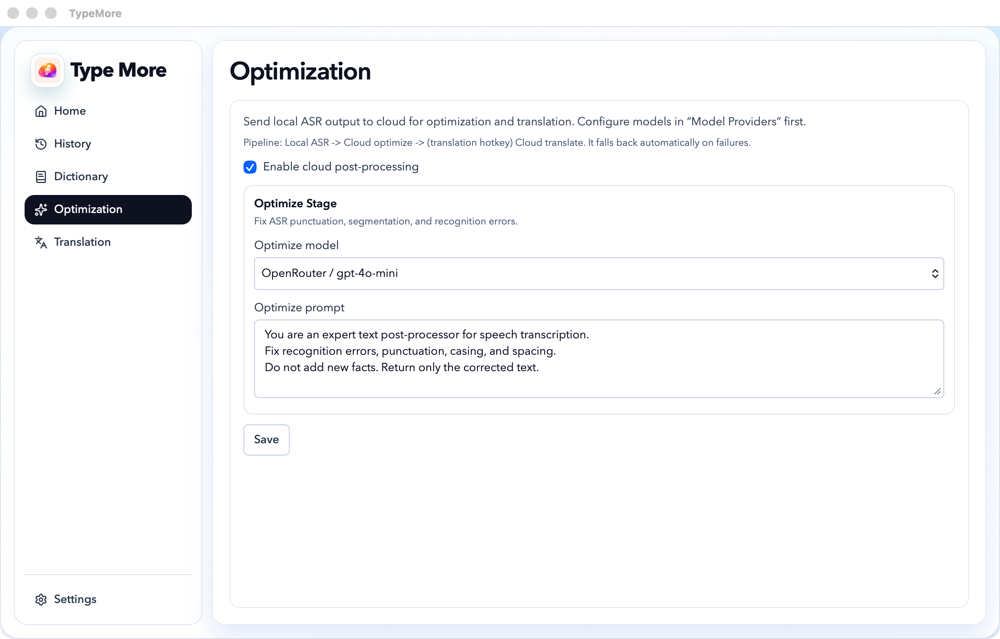
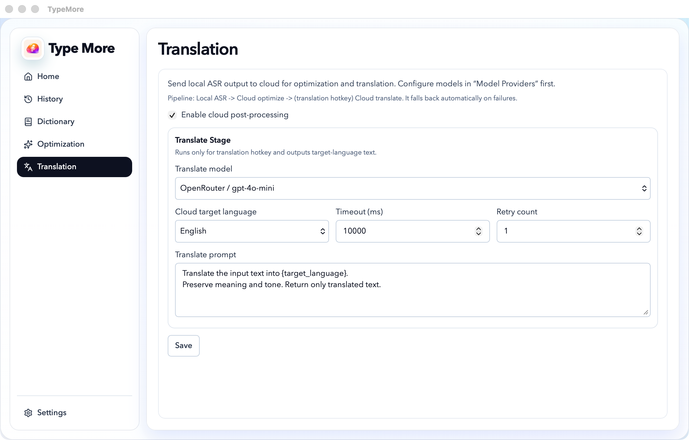

# TypeMore

[English README](./README.md)

TypeMore 是一款同时支持 macOS 和 Windows 的离线语音转文字桌面应用。它会在本地采集你的语音、在设备上完成语音识别，并通过快捷键工作流把结果回填到当前输入位置。


<p align="center">
  
  
  
</p>

## 为什么选择 TypeMore

- 离线优先：音频数据保留在你的设备上。
- 原生桌面工作流：支持全局快捷键、悬浮反馈、录音历史。
- 开源：基于 Tauri + React + Rust 构建。
- 面向真实写作场景：支持听写、优化、可选云端后处理和翻译。

## 工作原理

TypeMore 使用基于 `sherpa-onnx` 和 `sherpa-rs` 的本地语音识别流程。

1. 首次启动时，TypeMore 会将语音模型下载到应用数据目录。
2. 当你按住或点击已配置的快捷键时，应用会在本地录制麦克风音频。
3. Rust 后端会把音频转换成 16k 单声道 WAV，并执行离线语音识别。
4. 识别出的文本会显示在应用中，并与录音一起缓存，随后可以回填到当前输入目标。
5. 如果你启用了云端后处理，本地转写结果还可以在离线识别完成后交给你配置的服务商做优化或翻译。

核心链路始终保持本地可用。云服务是可选项，不是基础听写所必需的。

## 安装

### Homebrew

```bash
brew update && brew install --cask everettjf/tap/typemore
```

后续升级：

```bash
brew upgrade --cask typemore
```

### 直接下载

从 GitHub Releases 下载最新已公证的 DMG：

- Releases 页面：<https://github.com/everettjf/typemore/releases>
- 最新 DMG：<https://github.com/everettjf/typemore/releases/latest/download/TypeMore.dmg>

### Windows 安装包

使用 Inno Setup 在本地构建 Windows 安装包：

```powershell
npm run build:win-installer
```

## 社区

- 官网：<https://typemore.app>
- Discord：<https://discord.com/invite/eGzEaP6TzR>

## 功能特性

- macOS / Windows 离线语音识别
- macOS 内置 `Fn` / `Fn+Shift` 触发流程
- 自定义全局快捷键
- 录音历史，支持重命名、删除、重新转写
- 自定义词库
- 可选云端优化和翻译
- 启动时更新检查与 7 天稍后提醒

## 数据存储

TypeMore 会把运行时数据存储在 Tauri 的应用数据目录下，包括：

- 下载的语音模型文件
- 录音文件
- 转写缓存
- 词库数据
- 临时转换文件

## 参与贡献

如果你希望在本地构建、调试或发布 TypeMore，请查看 [CONTRIBUTING.md](./CONTRIBUTING.md)。

## 许可证

Apache-2.0。详见 [LICENSE](./LICENSE)。
